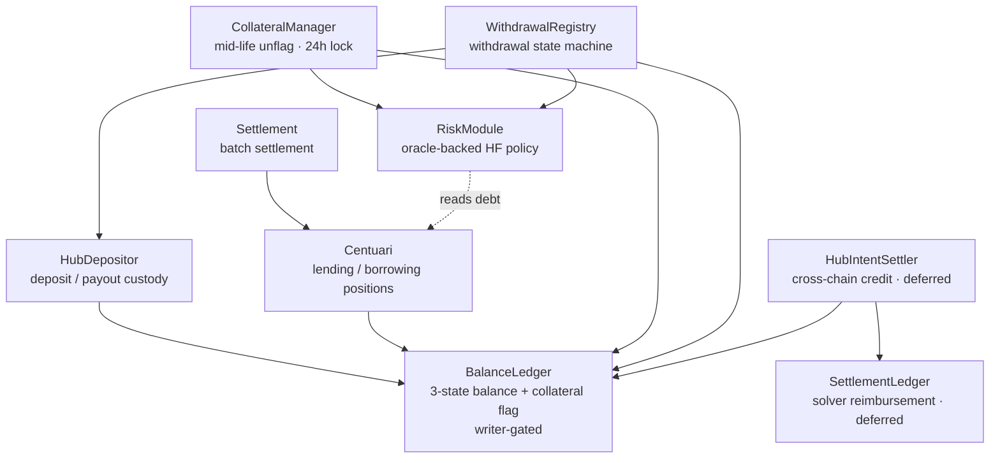

# Centuari · Smart Contracts

The on-chain core of the Centuari decentralized lending protocol. This
Foundry/Solidity codebase contains upgradeable contracts (OpenZeppelin v5 and
ERC1967 proxies) deployed to Arbitrum Sepolia. These contracts custody tokens,
record lending/borrowing positions, settle matched orders in batches, and gate
withdrawals on an oracle-backed health factor.

This is the contract component in the Centuari system. For the public system map,
see the [umbrella README](https://github.com/centuari-labs/centuari).

---

## Design at a glance

- **Order-book lending, settled on-chain.** Orders are matched off-chain (see the
  [matching engine](https://github.com/centuari-labs/matching-engine)) and
  settled here in batches by the `Settlement` contract.
- **Deposit-first balance model.** `BalanceLedger` holds a 3-state balance
  (`available` / `inOrders` / `inYieldRouter`) per user/asset and is the single
  writer-gated source of truth other contracts mutate.
- **Virtual, HF-gated collateral.** Borrowing locks no balance. An on-chain
  `usedAsCollateral` flag is set automatically at settlement; withdrawals and
  unflags are gated by `RiskModule` on a post-action health factor ≥ 1.
- **Upgradeable by construction.** Every core contract is an ERC1967 proxy with a
  separate `*Storage` layout + storage gap, snapshot-enforced in CI.

## Tech stack

Solidity 0.8.x · Foundry (forge / cast / anvil) · OpenZeppelin v5 (standard +
upgradeable) · ERC1967 transparent proxy · ERC7201 namespaced storage ·
Arbitrum Sepolia

## Contract architecture



`BalanceLedger` is the hub: only authorized writers (`Centuari`, `Settlement`,
`HubDepositor`, `CollateralManager`, `WithdrawalRegistry`, `HubIntentSettler`)
may mutate it. Markets are identified by
`bytes32 marketId = keccak256(abi.encode(loanToken, maturity))`. The same loan
token at different maturities is a different market.

### Core contracts

| Contract | Role |
|---|---|
| **BalanceLedger** | 3-state balance model + on-chain collateral flag; writer-gated |
| **Centuari** | Lending/borrowing positions; auto-flags collateral at settlement. `repay` does **not** unflag |
| **Settlement** | Batch settlement processor; validates matches, prevents double-settlement |
| **HubDepositor** | Hub-native (Arbitrum) deposit/payout and token custody |
| **CollateralManager** | The only user-facing unflag seam: 24h flag-lock + `RiskModule` gate |
| **RiskModule** | Oracle-backed HF policy: `canWithdraw` / `canUnflag`, fail-closed on missing/stale price |
| **WithdrawalRegistry** | Withdrawal state machine; first action is the `RiskModule` HF gate |
| **HubIntentSettler** | Cross-chain credit plumbing (`confirmDeposit`); cross-chain user flows deferred in the current launch |
| **SettlementLedger** | Solver reimbursement tracking; deferred in the current launch |
| **CentuariBondERC20(Factory)** | Bond tokens minted for lenders |
| **MockToken / Faucet** | Testnet ERC20s + drip |

### Collateral semantics

The `usedAsCollateral` flag is written by exactly three paths: `Settlement`
(auto-flag at settle), `CollateralManager.unflagFor` (24h lock + `RiskModule`
gate), and the liquidation auto-unmark on full collateral drain.
`Centuari.repay()` does **not** touch the flag. A borrower stays flagged after
full repayment until they explicitly unflag. There is no
user-callable toggle.

## Repository layout

```
src/
├── core/
│   ├── balance-ledger/   # BalanceLedger + storage
│   ├── centuari/         # Centuari + bond token + factory
│   ├── collateral/       # CollateralManager
│   ├── cross-chain/      # HubDepositor, WithdrawalRegistry, HubIntentSettler, SettlementLedger
│   ├── risk/             # RiskModule
│   └── settlement/       # Settlement
├── interfaces/           # I* interfaces (interface-first design)
├── libraries/            # DateTime (bond token names)
├── mocks/                # MockToken, Faucet
└── utils/                # ERC7201 ReentrancyGuardUpgradeable
script/                   # Deploy*/Upgrade* scripts (deferred cross-chain under script/deferred/)
test/                     # Foundry *.t.sol tests + storage-layout snapshots
bin/                      # deployment orchestration (run-all.sh, deploy-hardened.sh, sync-to-services.sh)
abi/                      # exported ABIs (export-abi.sh)
```

## Getting started

```bash
forge build           # compile (optimizer + via_ir)
forge test            # run the full test suite
forge test -vvvv      # verbose traces
anvil                 # local chain
```

## Deployment

The current launch target is **Arbitrum Sepolia (chain `421614`)**. Mainnet is
not the active launch. The orchestrator contains cross-chain hub contracts, but
spoke-chain processors and cross-chain user flows remain deferred until a later
launch phase.

### Testnet orchestration

`bin/run-all.sh` is a 14-stage Foundry orchestration. Some stages are optional
or may be skipped when their prerequisite address or configuration file is not
available; always review the command output and deployment summary.

1. `DeployMockTokens`
2. `DeployFaucet`
3. `DeployBalanceLedger`
4. `DeployCentuari`
5. `DeployBondFactory`
6. `DeployHubDepositor`
7. `DeployRiskModule` + `ConfigureRiskModule`
8. `DeployCollateralStack`
9. `DeploySettlement`
10. `SetSettlement` on `Centuari`
11. `UpgradeSettlement` (optional)
12. `SetOperators`
13. `DeployCrossChainHub` (implemented, but cross-chain use is deferred)
14. `DeployLiquidationEngine` (optional; set `SKIP_LIQUIDATION=1` to skip)

Create the local environment file and keep all credentials out of shell
arguments and command history:

```bash
cp .env.example .env
chmod 600 .env
# Edit .env locally. Never commit it or paste its contents into chat/logs.
```

For a real testnet broadcast, set these values in the untracked `.env` file:

| Variable | Purpose |
|---|---|
| `RPC_URL` | Target chain RPC; use an Arbitrum Sepolia endpoint for the active launch. |
| `PRIVATE_KEY` | Testnet-only deployer key. The script uses it to derive the deployer address. |
| `BACKEND_OPERATOR` | Required Faucet/RiskModule backend operator address. |
| `SETTLEMENT_OPERATOR` | Required Settlement engine operator address. |
| `ETHERSCAN_API_KEY` | Optional for testnet; enables Arbiscan verification on real-network broadcasts. |

`FAUCET_TOKENS`, existing contract addresses, and the `PROXY_ADMIN` /
`SETTLEMENT_PROXY` pair are optional inputs for reuse or the optional upgrade
stage. The risk and liquidation parameter files default to the matching files
under `script/config/`. If explorer verification is intentionally unavailable,
use `SKIP_VERIFY=1` or `--no-verify`; do not put a credential-bearing URL in a
README or command example.

After reviewing the target chain and `.env`, run the testnet flow:

```bash
./bin/run-all.sh --broadcast
```

On completion, `run-all.sh` exports ABIs, synchronizes addresses to consumer
services, and runs `sync-to-services.sh --check` unless `SKIP_SYNC=1` is set.
Deployment summaries are written to
`deployments/deploy-<network>-latest.json`.

### Mainnet boundary

Arbitrum One (chain `42161`) is not the current Centuari launch target. If a
future mainnet deployment is explicitly authorized, use only
`bin/deploy-hardened.sh`. It validates a real multi-signature Safe, deploys the
contracts, hands ownership and proxy administration to timelocks, assigns pause
authority to the Safe, and verifies that the deployer owns nothing. The default
mode is a no-broadcast preview:

```bash
# Preview only; loads SAFE_ADDRESS and RPC_URL from the untracked .env.
./bin/deploy-hardened.sh

# Only after production governance approval, with required values in .env.
./bin/deploy-hardened.sh --execute --mainnet-ack
```

The hardened path requires `SAFE_ADDRESS` and `RPC_URL`; `PRIVATE_KEY` is
required only with `--execute`, and `ETHERSCAN_API_KEY` is required for an
Arbitrum One execution. The Safe must be a deployed multi-signature Safe with
at least two owners and a threshold of at least two. `OPS_DELAY` defaults to
24 hours for owner/setter actions and `UPGRADE_DELAY` defaults to 48 hours for
proxy upgrades; ownership transfers are single-step and irreversible.

> **Never use bare `run-all.sh --broadcast` for mainnet.** It leaves proxies
> owned by the deployer EOA and is intended for testnet iteration. Mainnet
> execution must pass through the hardened preview, handover, and verification
> flow.

## Conventions

- **Storage/logic separation:** upgradeable contracts keep all state in
  `*Storage.sol` with a `uint256[N] private __gap`. Never reorder/remove storage
  variables; only append, shrinking the gap. Layout is snapshot-enforced by
  `bin/check-storage-layout.sh` in CI.
- **Interface-first:** external surface defined in `interfaces/`; contracts
  interact through interfaces, never concrete types.
- **Access control via modifiers:** `onlySettlement`, `onlyOperator`,
  `onlyAuthorizedWriter`, `whenNotPaused`. Never inline checks.
- **Custom errors**, not `require` strings. **Events for every state change**
  (off-chain indexers depend on them). **SafeERC20** for all transfers.
- **`initialize()` over constructor** with `_disableInitializers()`; ERC7201
  namespaced reentrancy guard to avoid proxy storage collisions.
- **Rates in basis points** (`RATE_PRECISION = 10000`); no magic numbers.

### foundry.toml

```toml
via_ir = true       # IR codegen (required for the more complex contracts)
optimizer = true
```

## Testing

Foundry tests live in `test/` (`*.t.sol`) and use mock contracts for isolation.
Coverage includes all access-control revert paths, upgrade/storage-layout
compatibility, settlement edge cases (zero amounts, expired maturities, duplicate
settlement), and collateral-flag semantics (idempotent mark, flag-lock
enforcement, and the invariant that `repay` never unflags). Run `forge test`
before considering any contract change complete.
