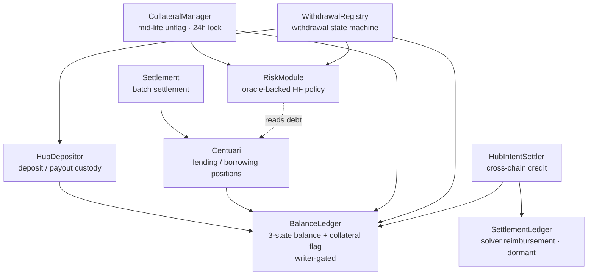

# Centuari · Smart Contracts

The on-chain core of the Centuari decentralized lending protocol — a Foundry /
Solidity codebase of upgradeable contracts (OpenZeppelin v5, ERC1967 proxies)
deployed to Arbitrum Sepolia. These contracts custody tokens, account balances,
record lending/borrowing positions, settle matched orders in batches, and gate
withdrawals on an oracle-backed health factor.

This is one of nine services in the Centuari system. For the big picture, see the
[umbrella README](https://github.com/centuari-labs/centuari).

---

## Design at a glance

- **Order-book lending, settled on-chain.** Orders are matched off-chain (see the
  [matching engine](https://github.com/centuari-labs/matching-engine)) and
  settled here in batches by the `Settlement` contract.
- **Deposit-first balance model.** `BalanceLedger` holds a 3-state balance
  (`available` / `inOrders` / `inYieldRouter`) per user/asset and is the single
  writer-gated source of truth other contracts mutate.
- **Virtual, HF-gated collateral.** Borrowing locks no balance. An on-chain
  `usedAsCollateral` flag is set automatically at settlement; withdrawals and
  unflags are gated by `RiskModule` on a post-action health factor ≥ 1.
- **Upgradeable by construction.** Every core contract is an ERC1967 proxy with a
  separate `*Storage` layout + storage gap, snapshot-enforced in CI.

## Tech stack

Solidity 0.8.x · Foundry (forge / cast / anvil) · OpenZeppelin v5 (standard +
upgradeable) · ERC1967 transparent proxy · ERC7201 namespaced storage ·
Arbitrum Sepolia

## Contract architecture



`BalanceLedger` is the hub: only authorized writers (`Centuari`, `Settlement`,
`HubDepositor`, `CollateralManager`, `WithdrawalRegistry`, `HubIntentSettler`)
may mutate it. Markets are identified by
`bytes32 marketId = keccak256(abi.encode(loanToken, maturity))` — the same loan
token at different maturities is a different market.

### Core contracts

| Contract | Role |
|---|---|
| **BalanceLedger** | 3-state balance model + on-chain collateral flag; writer-gated |
| **Centuari** | Lending/borrowing positions; auto-flags collateral at settlement. `repay` does **not** unflag |
| **Settlement** | Batch settlement processor; validates matches, prevents double-settlement |
| **HubDepositor** | Hub-native (Arbitrum) deposit/payout and token custody |
| **CollateralManager** | The only user-facing unflag seam: 24h flag-lock + `RiskModule` gate |
| **RiskModule** | Oracle-backed HF policy: `canWithdraw` / `canUnflag`, fail-closed on missing/stale price |
| **WithdrawalRegistry** | Withdrawal state machine; first action is the `RiskModule` HF gate |
| **HubIntentSettler** | Cross-chain credit (`confirmDeposit`); solver `fillFor` path dormant in Phase 1 |
| **SettlementLedger** | Solver reimbursement tracking — dormant in Phase 1 |
| **CentuariBondERC20(Factory)** | Bond tokens minted for lenders |
| **MockToken / Faucet** | Testnet ERC20s + drip |

### Collateral semantics

The `usedAsCollateral` flag is written by exactly three paths: `Settlement`
(auto-flag at settle), `CollateralManager.unflagFor` (24h lock + `RiskModule`
gate), and the liquidation auto-unmark on full collateral drain.
`Centuari.repay()` deliberately does **not** touch the flag — a borrower stays
flagged after full repayment until they explicitly unflag. There is no
user-callable toggle.

## Repository layout

```
src/
├── core/
│   ├── balance-ledger/   # BalanceLedger + storage
│   ├── centuari/         # Centuari + bond token + factory
│   ├── collateral/       # CollateralManager
│   ├── cross-chain/      # HubDepositor, WithdrawalRegistry, HubIntentSettler, SettlementLedger
│   ├── risk/             # RiskModule
│   └── settlement/       # Settlement
├── interfaces/           # I* interfaces (interface-first design)
├── libraries/            # DateTime (bond token names)
├── mocks/                # MockToken, Faucet
└── utils/                # ERC7201 ReentrancyGuardUpgradeable
script/                   # Deploy*/Upgrade* scripts (deferred cross-chain under script/deferred/)
test/                     # Foundry *.t.sol tests + storage-layout snapshots
bin/                      # deployment orchestration (run-all.sh, deploy-hardened.sh, sync-to-services.sh)
abi/                      # exported ABIs (export-abi.sh)
```

## Getting started

```bash
forge build           # compile (optimizer + via_ir)
forge test            # run the full test suite
forge test -vvvv      # verbose traces
anvil                 # local chain
```

## Deployment

```bash
# Testnet (Arbitrum Sepolia) — 12-step orchestration, auto-verifies on Arbiscan,
# then propagates ABIs + addresses into every consumer service.
RPC_URL=https://... PRIVATE_KEY=0x... ./bin/run-all.sh --broadcast

# Mainnet — secure-by-construction path: deploy + move every owner/ProxyAdmin/
# pauser onto a Gnosis Safe behind 24h ops / 48h upgrade timelocks. Preview by
# default; --execute to broadcast.
./bin/deploy-hardened.sh --execute --mainnet-ack
```

After a deploy, `run-all.sh` runs `export-abi.sh` then
`sync-to-services.sh --check`, failing loudly if any service didn't land on the
new addresses/ABIs. Deployment summaries are written to
`deployments/deploy-<network>-latest.json`.

> **Mainnet uses `deploy-hardened.sh`, not bare `run-all.sh`.** `run-all.sh`
> leaves every proxy owned by the deployer EOA — fine for testnet iteration,
> unsafe as a mainnet end-state.

## Conventions

- **Storage/logic separation** — upgradeable contracts keep all state in
  `*Storage.sol` with a `uint256[N] private __gap`. Never reorder/remove storage
  variables; only append, shrinking the gap. Layout is snapshot-enforced by
  `bin/check-storage-layout.sh` in CI.
- **Interface-first** — external surface defined in `interfaces/`; contracts
  interact through interfaces, never concrete types.
- **Access control via modifiers** — `onlySettlement`, `onlyOperator`,
  `onlyAuthorizedWriter`, `whenNotPaused`. Never inline checks.
- **Custom errors**, not `require` strings. **Events for every state change**
  (off-chain indexers depend on them). **SafeERC20** for all transfers.
- **`initialize()` over constructor** with `_disableInitializers()`; ERC7201
  namespaced reentrancy guard to avoid proxy storage collisions.
- **Rates in basis points** (`RATE_PRECISION = 10000`); no magic numbers.

### foundry.toml

```toml
via_ir = true       # IR codegen (required for the more complex contracts)
optimizer = true
```

## Testing

Foundry tests live in `test/` (`*.t.sol`) and use mock contracts for isolation.
Coverage includes all access-control revert paths, upgrade/storage-layout
compatibility, settlement edge cases (zero amounts, expired maturities, duplicate
settlement), and collateral-flag semantics (idempotent mark, flag-lock
enforcement, and the invariant that `repay` never unflags). Run `forge test`
before considering any contract change complete.
